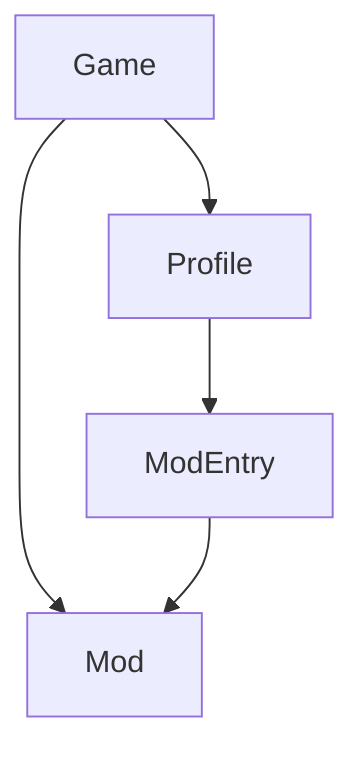
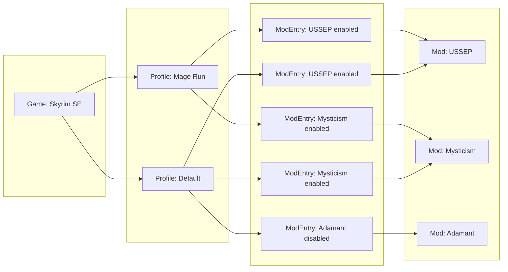

# `barnacle-lib`

## Graph Database

Barnacle uses a graph database called [agdb](https://agdb.agnesoft.com) to store its data. The schema is as follows:

Here's an example of what your database could look like:

